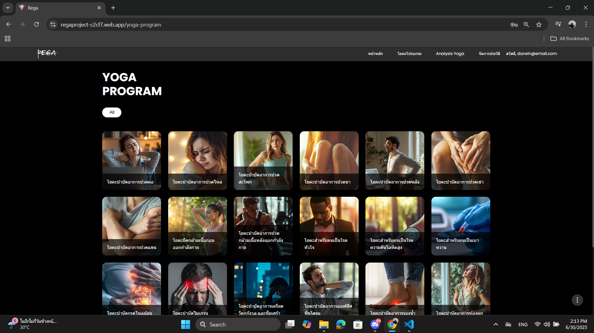
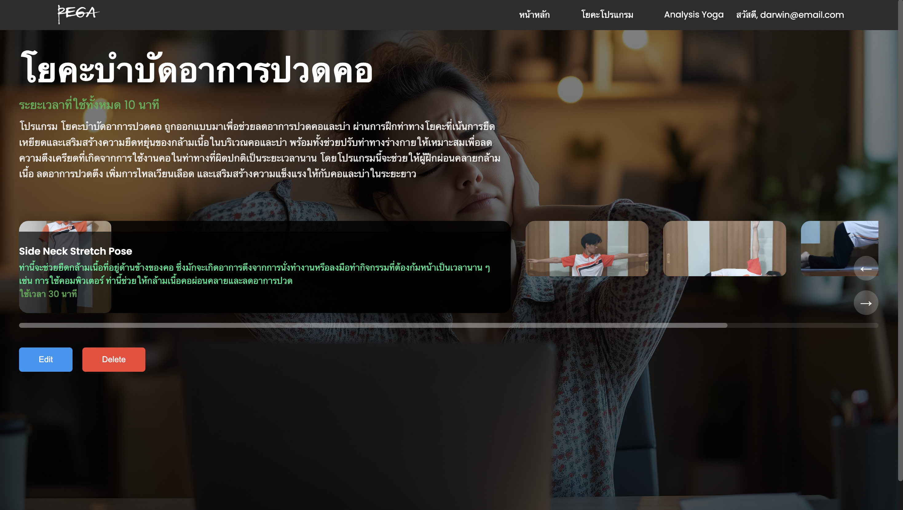
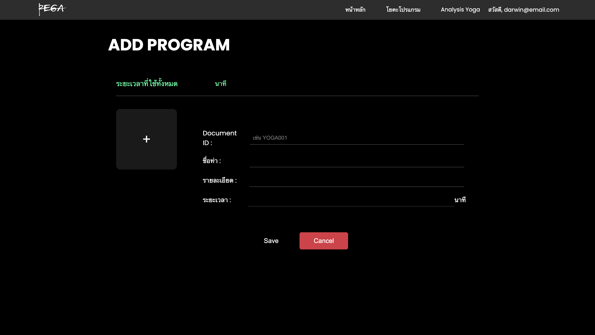
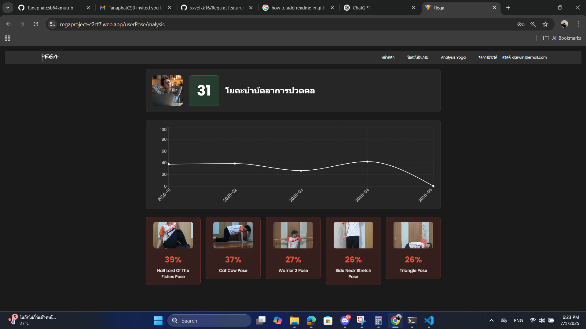
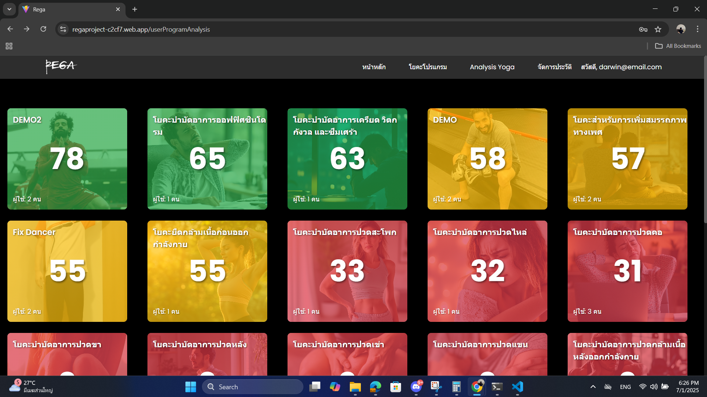

🧘‍♀️ Rega Web Controller
A web-based platform to manage and interact with the Rega app's database, built with modern tools to provide seamless experience and user-friendly interfaces.

📌 Project Overview
This project is a React-based web application designed to control and manage data from the Rega system — an app dedicated to fitness and yoga scheduling. With a clean user interface and Firebase integration, this platform allows administrators to view, update, and manage core database functionality with ease.

🔧 Tech Stack
Frontend: React (JSX)

Backend & Database: Firebase (Realtime Database / Firestore)

Design & UX/UI: Focused on user-friendly layouts and responsive components

🎨 UI Showcase
Below are a few screenshots demonstrating the interface and user experience:

   
 
   
 
  
